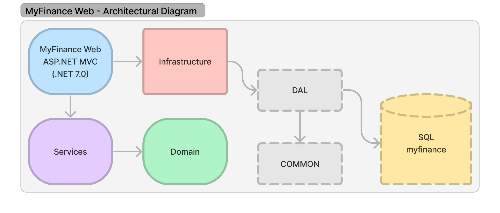

# My Finance Web 

A class project for Software Implementation and Evolution Practices from the Software Engineering Postgraduate Degree course at PUC Minas.

**My Finance Web** is a finance control Web Application, with MVC architecture, .NET C# 7.0.

### Architecture

-----
### Requirements

Packages:
- dotnet add package Microsoft.EntityFrameworkCore --version 7.0.13
- dotnet add package Microsoft.EntityFrameworkCore.SqlServer --version 7.0.13
- dotnet add package AutoMapper --version 12.0.1
- dotnet add package AutoMapper.Extensions.Microsoft.DependencyInjection  --version 12.0.1

